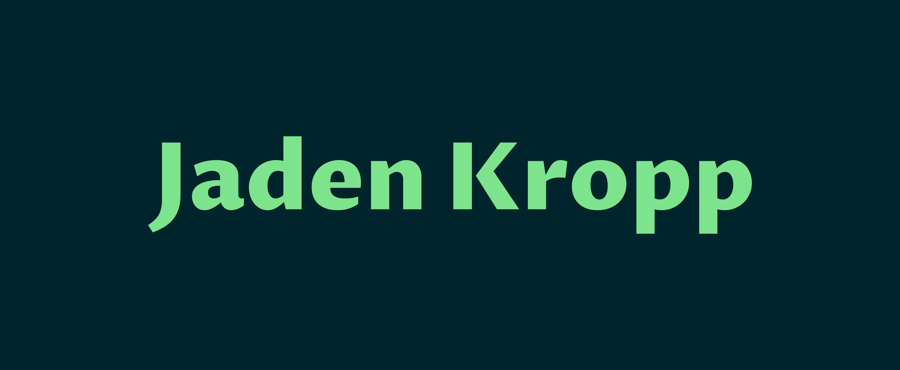
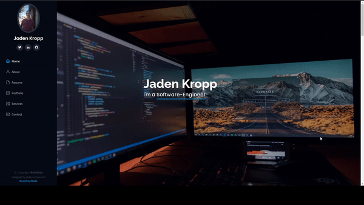
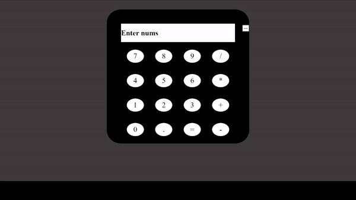

 

### 
My name is Jaden, and I am a fullstack software engineer.

 

  
  
  
  
<!--
    # this will be a template for future additions, also note to self: possibly add link to resume

    -->

<h1 align="center">Projects</h1>
<table bordercolor="#66b2b2" align="center">
  
  <tr>
    <td width="50%" valign="top">
      <h3 align="center">My Portfolio</h3>
       
        
       
        

  
  
      

        
<strong>HTML5, CSS3, & Javascript</strong> - This is my portfolio, it shows off my accomplishments, skills, and latest work.

    </td>
    <td width="50%" valign="top">
      <h3 align="center">Greasely Fights</h3>
         
      
         
        

          
  
  
      

        
<strong>HTML5, CSS3, & Javascript</strong> - This game takes inputs from two players, and allows them to control characters which fight for victory.

    </td>
  </tr>
  
  <tr>
    <td width="50%" valign="top">
      <h3 align="center">OOP Calculator</h3>
         
        
         
        

          
  
  
      

        
<strong>HTML5, CSS3, & Javascript</strong> - This project uses OOP programming to create a calculator object that then takes input from HTML buttons.

    </td>
    <td width="50%" valign="top">
      <h3 align="center">Shattered Edge Salon</h3>
         
        
         
        

          
  
  
      

        
<strong>HTML5 & CSS3</strong> - This is a website template that I built for my client Shattered Edge.

    </td>
  </tr>
</table>

<h1 align="center">Skills</h1>

   

      
      
      
      
   

